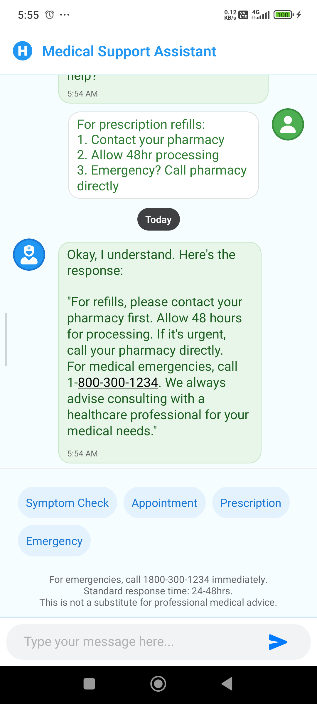
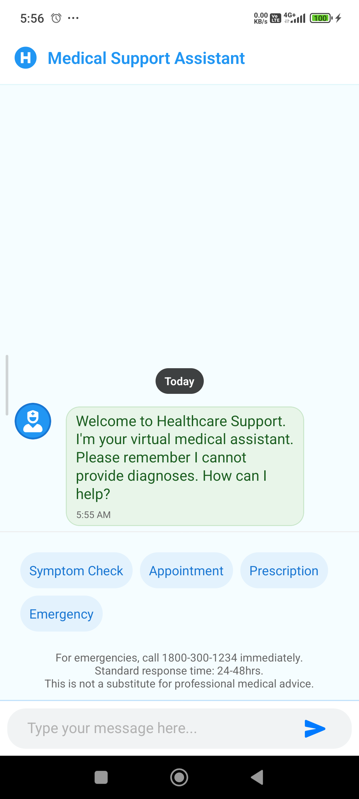

# MediChat - AI Medical Assistant


## Features

- Symptom checking guidance
- Emergency protocol activation
- Medication interaction checker
- AR first aid instructions
- Secure API key management

## Prerequisites

- Node.js >= 16.x
- Expo CLI
- iOS/Android simulator or physical device
- Google Gemini API key

## Setup Guide

### 1. Clone Repository
```bash
git clone https://github.com/priyanshu-banshisoft/medichat.git
cd medichat
```

### 2. Install Dependencies
```bash
npm install
npx expo install expo-secure-store expo-linking react-native-dotenv
```

### 3. Configure Environment

Create `.env` file in root directory:
```env
MED_API_KEY=your_google_api_key
```

### 4. Get API Keys

1. **Google Gemini API**:
   - Visit [Google AI Studio](https://aistudio.google.com/)
   - Create new API key
   - Add to `.env` as `MED_API_KEY`


### 5. Run Application

```bash
npx expo start
```

Scan QR code with Expo Go app or press:
- `i` for iOS simulator
- `a` for Android emulator

## Security Configuration

1. **Secure API Storage**:
```bash
npx expo install expo-secure-store
```

2. **Enable Encryption** (Android):
```xml
<!-- android/app/src/main/AndroidManifest.xml -->
<application
  ...
  android:usesCleartextTraffic="false">
```

## Important Notes

- 🚨 Never commit `.env` file
- 📱 Minimum Android API 28 / iOS 14
- 🔒 Enable app signing for production
- ⚠️ For demo purposes only - not real medical advice


**Build Issues**:
```bash
npx expo doctor
npx expo install --fix
```

## App Preview

|  |  

## License
MIT License - See [LICENSE](LICENSE)
